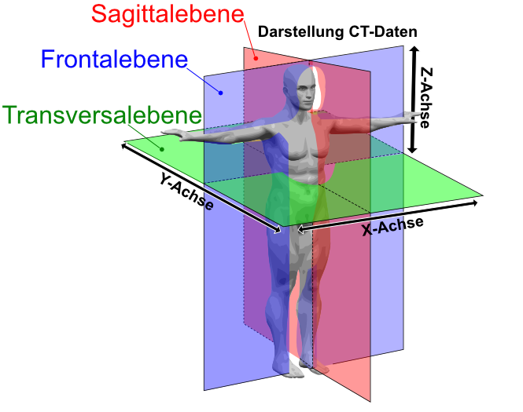

# Aufgabenstellung

Implementieren Sie einen CT-Viewer, der mindestens die unten genannten Anforderungen erfüllt.

## Anforderungen an die Software

1. Das Programm muss ein Menü haben, um die einzelnen Aktionen aufrufen zu können (Beenden, Laden, ...).
- [x] fertig

2. Die Daten der behandelten Person müssen in der GUI angezeigt und bearbeitet werden können.
- [x] fertig
3. Die bearbeiteten Patientendaten müssen wieder in dieselbe oder in eine andere Datei gespeichert werden können.
- [x] fertig
4. Die Bilddaten müssen in allen Hauptebenen (frontal, sagittal, horizontal) als Bilder in der GUI darstellbar sein.
- [x] fertig
5. Die Darstellung der Bilder kann auf verschiedene Arten erfolgen. Es soll jedoch mindestens die Möglichkeit bestehen jeweils ein Bild darzustellen und über einen Schieberegler auszuwählen, welches Bild dies sein soll. Wird der Schieberegler langsam bewegt, sieht es aus, als ob die Schichten fließend ineinander übergehen (wie ein Film).
- [x] fertig
6. Die Anwendung muss eine gut strukturierte Architektur haben, zum Beispiel Model-View-Controller oder Model-View-Presenter.
- [x] fertig
7. Jede Aktion soll gelogged werden. Die entsprechenden Meldungen sollen auf der Konsole *und* in Dateien abgelegt werden.
- [x] fertig
8. Die Anwendung ist mit Java-eigenen Mitteln zu internationalisieren. Dies gilt für alle Strings sowie für das Datumsfeld, das im jeweils sprachspezifischen Format dargestellt und bearbeitet werden können soll. Die Anwendung sollte mindestens die Sprachen Deutsch und Englisch unterstützen.
- [x] fertig

## Hinweise zur Implementierung

* Das Einlesen der Daten muss nur dann fehlerfrei funktionieren, wenn die einzulesende Datei keine Fehler enthält.
* Achten Sie auf eine gute Architektur der Anwendung sowie auf die üblichen	Programmierkonventionen.
* Eine gute und klare Dokumentation ist notwendig für eine erfolgreiche Bearbeitung.
* Die Darstellung (Grafische Oberfläche) ist von der fachlichen Logik zu trennen. Das heißt zum Beispiel, dass es eine Klasse geben sollte, welche für die Darstellung eines Bilddatensatzes zuständig ist, eine andere wiederum für deren Speicherung.
* Die Oberfläche darf grafisch schön gestaltet werden. Sie müssen sich allerdings nicht verkünsteln. Viel wichtiger ist bei der Bearbeitung der Aufgabe, dass ihre Anwendung gut strukturiert ist, dass jede Klasse klar definierte Zuständigkeiten hat und sie keinen Spaghetti-Code produzieren.
- [x] erfüllt

# Hinweise zur Vorgehensweise

## Multi Module Project

Im Rahmen von Aufgabe 2 haben Sie Ihr Projekt in ein Multi-Module Maven Project konvertiert. Bauen Sie für diese Aufgabe auf Ihrem bisherigen Projektstand auf, d. h. verwenden Sie Ihren CT-Konverter für die Implementierung der IO-Schicht wieder.

Ergänzen Sie weitere Module:

1. Ein Modul für die Implementierung Ihrer Oberfläche sowie die entsprechende Business-Schicht.
- [x] fertig
2. Ein Modul für API (Schnittstellen) Klassen. Extrahieren Sie entsprechende Interface-Klassen aus Ihren bisherigen Modulen.
- [x] fertig
3. Ein Modul, welches die `main`-Methode Ihrer Anwendung enthält (Runtime-Modul).
- [x] fertig

Achten Sie insbesondere darauf, dass auch Source-Code und JavaDoc Artefakte während eines Maven Buildvorgangs erzeugt werden.

> Tipp: Zur Erzeugung dieser Artefakte können Sie das [Maven Source Plugin](https://maven.apache.org/plugins/maven-source-plugin/) bzw. das [Maven Javadoc Plugin](https://maven.apache.org/plugins/maven-javadoc-plugin/) verwenden.

## Gitlab CI/CD

Entwerfen und implementieren Sie eine Gitlab CI/CD Build-Pipeline, welche Ihre implementierten JUnit Tests automatisch ausführt und als Ergebnis ein sog. *executable jar* mithilfe des [Maven Shade Plugins](https://maven.apache.org/plugins/maven-shade-plugin/) erzeugt.
- [x] fertig

# Abgabe

Für das erfolgreiche Bestehen dieser Aufgabe sind folgende Punkte zu erfüllen:

1. Ein vollständiges Apache Maven Multi Module Project gemäß den oben genannten Anforderungen.
- [x] fertig
2. Eine vollständig und korrekte Umsetzung eines CT-Viewers gemäß der oben beschriebenen Anforderungen.
- [x] fertig
3. JUnit Tests, welche die Funktionalität der zu entwickelten Klassen demonstrieren und testen sowie über das Maven Surefire Plugin während eines Maven Builds automatisch ausgeführt werden.
- [x] fertig
4. Eine Gitlab CI/CD Pipeline, die das Projekt automatisch testet, baut und als Endergebnis ein `executable jar` mit Hilfe des Maven Shade Plugins erzeugt.
- [x] fertig
5. Kompilier- und lauffähiger Java-Code sowie Einhaltung der *Java Naming Conventions* und sinnvolles *Exception-Handling* sowie Dokumentation (Javadoc).
- [x] fertig
-
## Hinweis zur Korrektur

- Erfolgt die Abgabe **vor** dem 22.12.2022 werde ich die Korrektur noch in **2022** durchführen.
- Abgaben die am 22.12.2022 eingehen, werde ich erst im neuen Jahr (ab dem 09.01.2023) korrigieren.

## Verbildlichung

